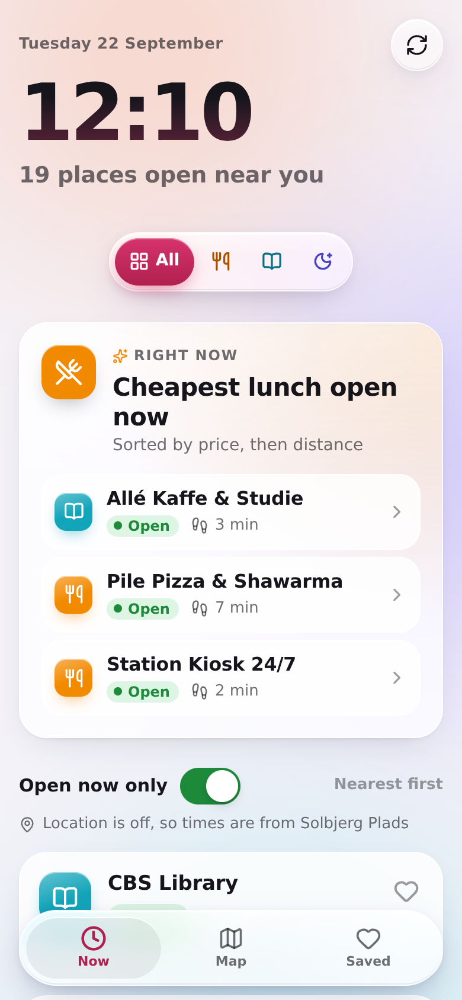
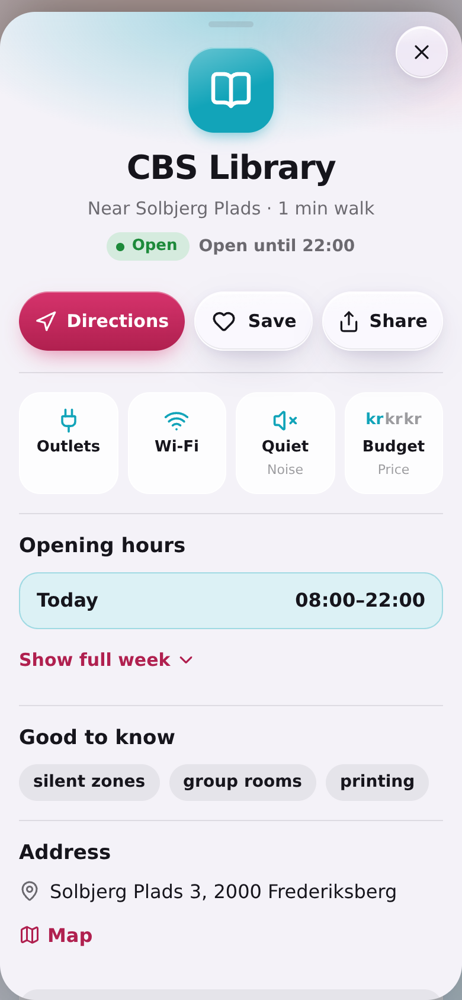
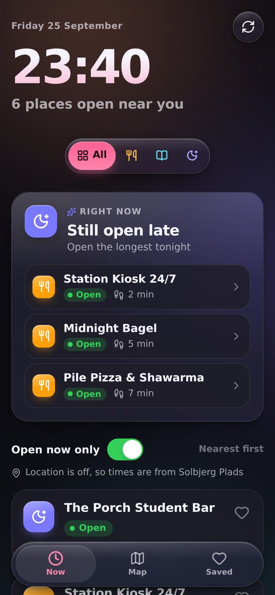
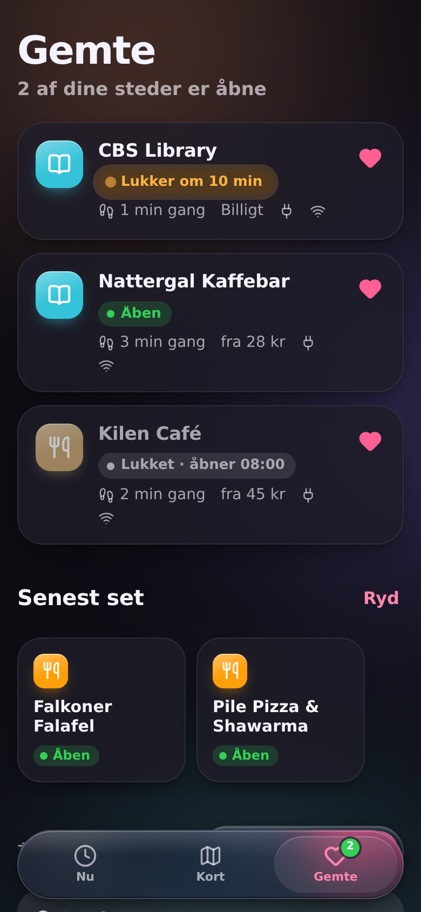

# Vespera

**Where can I go right now?** Vespera shows students at Copenhagen Business School which places near campus are open at this moment. It covers three kinds of place:

- **Food**: meals under ~75 kr
- **Study**: study spots with power outlets
- **Late night**: places open after 22:00

The first screen answers the question with no taps: a live clock, how many places are open, a time-of-day suggestion, and a feed sorted by walking time.

It's an installable web app (PWA) for phones and desktop. It is built with React, TypeScript and Vite, uses a Liquid Glass–inspired design, and has no backend: places ship as a local `places.json`.

<p>
  
  
  
  
</p>

> **The place data is placeholder data.** All 21 seed places have `"verified": false`. Replace them with checked data before relying on the app (see [Adding or editing places](#adding-or-editing-places)).

---

## Quick start

Requires Node 20.19+ (22 recommended).

```bash
npm install
npm run dev          # http://localhost:5173
npm run dev -- --host   # also reachable from your phone on the same Wi‑Fi
```

| Command | What it does |
| --- | --- |
| `npm test` | Runs the unit tests: opening hours, holidays, status labels, ranking, and a full check of `places.json` |
| `npm run test:tz` | Runs the same tests with the device set to Los Angeles and Auckland time, to prove results don't depend on the device clock |
| `npm run typecheck` | TypeScript, strict mode |
| `npm run build` | Typecheck and production build into `dist/` (a static site you can host anywhere) |
| `npm run preview` | Serves the production build locally |

CI (`.github/workflows/ci.yml`) runs typecheck, tests in three time zones, and the build on every push. `.github/workflows/pages.yml` deploys `main` to GitHub Pages. To enable it once: **Settings → Pages → Source: GitHub Actions**.

## Features

| Screen | What you get |
| --- | --- |
| **Now** (home) | Live Copenhagen clock and a rolling "14 places open near you" count. A floating glass filter (All · Food · Study · Late night) and an **Open now only** toggle (on by default). A **Right now** card that changes with the time of day: coffee + a desk in the morning, cheapest lunch, deep-work spots in the afternoon, dinner under 75 kr, and whatever stays open longest after 22:00. The header shrinks into a glass bar as you scroll. Pull to refresh re-evaluates every status. |
| **Map** | Full-screen map with glass pins coloured by category; closed places are dimmed. A glass bottom sheet (peek / half / full, drag or tap) lists the places in view. Tapping a pin morphs it into a floating card, and **Details** grows that card into the full detail. |
| **Place detail** | Grows out of whichever card you tapped. Shows a hero header, today's hours highlighted, a collapsible full week, quick facts (outlets, Wi‑Fi, noise, price), cheapest item, student deal and tags. **Directions** opens Apple Maps on Apple devices and Google Maps elsewhere; **Save** and **Share** use the native share sheet or copy a link. Swipe down, press Esc or use Back to close. |
| **Saved** | Favorites with live open/closed status (open ones first), recently viewed places, a language switch (English / Dansk), and a note about the data. Stored on the device only. |

Status pills read **Open**, **Closes in 25 min** (orange under 45 min, pulsing gently under 15), or **Closed · opens 08:00**. When the next opening is a day or more away, the weekday is added: **Closed · opens Mon 08:00**.

Other details:

- **Walking time** is distance ÷ 80 m/min, rounded up. It's measured from your location if you tap *Use my location*, otherwise from CBS Solbjerg Plads (also used if you're more than 15 km away). The app never asks for location on launch.
- **Haptics**: a light tap on filter changes and a success pattern on save. This uses the Vibration API on Android and the native switch haptic on iOS 18+ Safari.
- **Installable** with home-screen shortcuts straight to Food, Study or Late night. The app works offline after the first visit, because opening hours are computed on the device. Map tiles still need a connection.
- **Accessibility**: rem-based type that follows iOS Dynamic Type, full keyboard support (arrow keys in the filter, Esc, focus management in the detail), and screen-reader labels. Honours Reduce Motion, Reduce Transparency and Increase Contrast. All screens pass axe-core WCAG 2.1 AA checks in light and dark mode.
- **Languages**: English and Danish, detected from the browser and switchable under Saved.

## Project structure

```
src/
  models/        Pure TypeScript, no React. Easy to port to Swift later.
    time.ts            Copenhagen wall-clock ↔ instant conversion (DST-safe)
    openingHours.ts    Parsing "08:00-16:00", concrete open intervals, merging
    holidays.ts        Danish public holidays (Easter-based + fixed)
    status.ts          Open / closing soon / closed + labels
    ranking.ts         Snapshots (status + distance), feed order
    suggestions.ts     The time-of-day "Right now" card
    places.ts          Validates places.json with precise error messages
    geo.ts, types.ts
    *.test.ts          Vitest unit tests
  viewmodels/    Observable stores and hooks that turn models into screen state
                 (clock, location, filters, favorites, navigation, home view model)
  views/         Screens: HomeView, MapView, PlaceDetail, SavedView, SuggestionCard
  components/    Reusable UI: GlassCard, StatusPill, CategoryFilterBar, PlaceRow,
                 PlaceCard, TabBar, BottomSheet, MapPin, SaveButton, Toggle…
  services/      Storage, haptics, directions links
  i18n/          English + Danish strings (Danish must cover every English key)
  resources/     places.json
  styles/        Design tokens (light/dark) and the glass material
public/          Icons, web manifest, service worker
```

The state layer works like MVVM. Small observable stores (`viewmodels/store.ts`, built on `useSyncExternalStore`) hold app state, hooks like `useHomeViewModel()` derive screen state from it, and views just render. The clock ticks on every minute boundary, so status pills and counts update live.

## Adding or editing places

All places live in [`src/resources/places.json`](src/resources/places.json). Edit the file, then run `npm test`. The tests reject any mistake and tell you exactly which place and field is wrong, for example:

```
"kilen-cafe": openingHours.tue has an invalid range "8-16" (use "HH:MM-HH:MM")
```

In the dev server the same messages are logged to the browser console, and the broken place is left out instead of breaking the app.

### A complete entry

```json
{
  "id": "kilen-cafe",
  "name": "Kilen Café",
  "categories": ["food", "study"],
  "campus": "kilen",
  "coordinate": { "latitude": 55.68088, "longitude": 12.52905 },
  "address": "Kilevej 14A, 2000 Frederiksberg",
  "openingHours": {
    "mon": ["08:00-17:00"],
    "tue": ["08:00-17:00"],
    "wed": ["08:00-17:00"],
    "thu": ["08:00-17:00"],
    "fri": ["08:00-17:00"],
    "holidays": []
  },
  "priceLevel": 1,
  "cheapestItem": { "name": "Sandwich", "price": 45 },
  "hasOutlets": true,
  "wifi": true,
  "noiseLevel": "medium",
  "studentDiscount": null,
  "tags": ["coffee", "group tables"],
  "verified": false
}
```

### Fields

| Field | Required | Values |
| --- | --- | --- |
| `id` | yes | Unique, lowercase letters, digits and dashes (`"kilen-cafe"`). Used in shareable links and saved favorites, so don't change it once people use the app. |
| `name` | yes | Display name. |
| `categories` | yes | One or more of `food`, `study`, `lateNight`. The **first** one sets the icon and colour. |
| `campus` | yes | Nearest campus: `solbjergPlads`, `porcelaenshaven`, `kilen`, `dalgasHave`, `howitzvej`. |
| `coordinate` | yes | `{ "latitude": …, "longitude": … }`. In Google Maps or Apple Maps, right-click (or long-press) the spot to copy it. |
| `address` | yes | Street address. |
| `openingHours` | yes | See below. |
| `priceLevel` | yes | `1` budget, `2` mid-range, `3` pricier. |
| `cheapestItem` | no | `{ "name": "Sandwich", "price": 45 }` (price in kr) or `null`. |
| `hasOutlets`, `wifi` | yes | `true` / `false`. |
| `noiseLevel` | yes | `quiet`, `medium` or `lively`. |
| `studentDiscount` | no | Short text, or `null`. |
| `tags` | no | List of short strings shown under "Good to know". A `"coffee"` tag makes a place eligible for the morning suggestion. |
| `verified` | no | Set to `true` once someone has checked the place on site. Unverified places show a notice in the detail view. |

The tests also enforce what each category promises. Every **food** place needs a `cheapestItem` of 75 kr or less, every **study** place needs `"hasOutlets": true`, and every **lateNight** place must be open past 22:00 at least once a week.

### Opening hours

Each weekday key (`mon` … `sun`) holds a list of `"HH:MM-HH:MM"` ranges, in Copenhagen local time.

| You want | Write |
| --- | --- |
| Normal day | `"mon": ["08:00-16:00"]` |
| Lunch break | `"mon": ["08:00-10:30", "11:00-15:00"]` |
| Open past midnight | `"fri": ["18:00-02:00"]`: a closing time earlier than the opening time means *the next morning*. Put it on the day it **opens**. Saturday 01:30 counts as open on Friday's hours. |
| Closes at midnight | `"mon": ["22:00-00:00"]` or `["22:00-24:00"]` |
| Open 24 hours | `"mon": ["00:00-24:00"]`. On consecutive days these merge, so the app shows "Open", not "closes at midnight". |
| Closed that day | `"sun": []` or leave the key out |
| Danish public holidays | `"holidays": []` means closed on holidays. `"holidays": ["10:00-14:00"]` gives special hours. Leave the key out to use the normal weekday hours. |

Holidays covered: New Year's Day, Maundy Thursday, Good Friday, Easter Sunday and Monday, Ascension Day, Whit Sunday and Monday, Constitution Day (5 June), Christmas Eve, Christmas Day, Boxing Day and New Year's Eve. Store Bededag is not included, because it was abolished from 2024.

## How "open now" works

`openingHours.ts` turns the weekly schedule into real time intervals for yesterday through the next week. Each range is anchored to the day it starts, holiday overrides are applied, and overlapping or touching intervals are merged. The status is then a lookup: find the interval that contains *now*, or the next one that starts.

All wall-clock math uses Europe/Copenhagen via `Intl`, independent of the device's time zone, and handles both daylight-saving switches. For example, "01:00–04:00" on the spring-forward night is two real hours. The tests cover past-midnight ranges, Sunday→Monday wrap-around, 24/7 merging, lunch breaks, both DST nights, holiday overrides, and overnight ranges that start the evening before a holiday.

## Design notes

- **Glass is for controls, not for reading surfaces.** The tab bar, filter, sticky header, bottom sheet, map pins and buttons use translucent glass (backdrop blur + saturation, a specular edge highlight and a soft sheen). Cards use a mostly opaque surface so text stays crisp. The one exception is the featured "Right now" card.
- Content runs edge to edge under floating chrome, with 24–30 px corner radii and 16–20 px gutters. The system font (SF Pro on Apple devices) is used throughout.
- Category accents: food = warm orange, study = teal, late night = indigo. The brand accent is an evening-star rose. Every colour is a token in `styles/tokens.css`, with light and dark values.
- Motion uses one spring everywhere (`components/motion.ts`), roughly SwiftUI's `spring(response: 0.35, dampingFraction: 0.8)`. Shared-layout transitions morph card → detail and pin → card → detail. Filter changes animate cards in and out.

## Notes

- **Map tiles** come from [CARTO](https://carto.com/basemaps) (OpenStreetMap data), which is free for low-traffic, non-commercial use with attribution. For heavier use, switch `tileUrl` in `src/views/MapView.tsx` to your own tile provider.
- **Porting to iOS later:** `places.json` uses the same schema an iOS app would. `src/models` has no UI dependencies and maps one-to-one to Swift types (`OpeningHours`, `OpenStatus`, `PlaceSnapshot`), and the unit tests translate directly into XCTest or Swift Testing cases.
